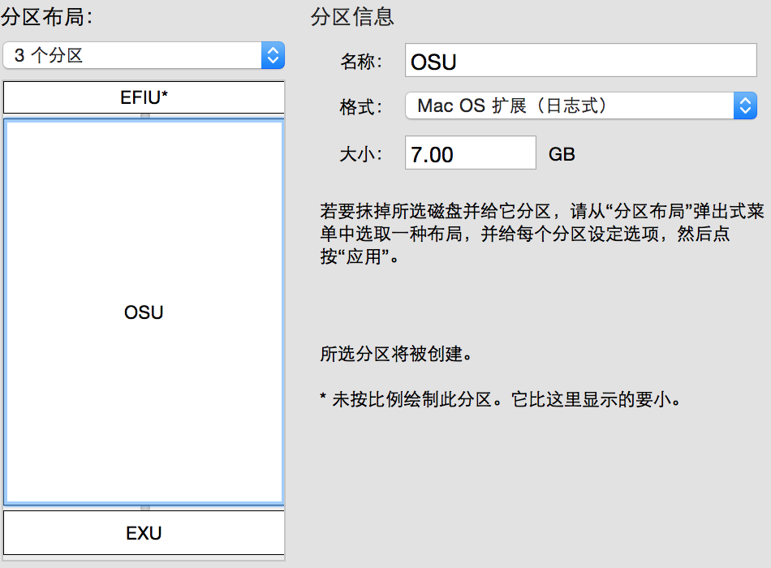

    title: where is my new blog?
    description: a bug?

####1  冒号之后一定要有空格，否则编译不通过。
####2  全英文，文件编码可以为：cp936,utf-8
####3  含有中文时,文件编码一定是：utf-8.

vim下改变编码：  

    :set fileencoding=utf-8

####4  插入图片时，图片不能放入_post/下，否则导致整站的.md不能编译通过  

>The page build failed with the following error:  
>Page build failed. For more information, see https://help.github.com/articles/troubleshooting-github-pages-build-failures.  
>If you have any questions you can contact us by replying to this email.  

可以如下：

     

html img 标签可以控制markdown图片大小.
