下文tu显示不正常，详情参见 https://github.com/ldengjie/ldengjie.github.io/blob/master/_posts/blog/2015-03-20-install-yosemite-on-dell-3020-mini-tower.md

###硬件信息：台式机  

电脑型号    戴尔 OptiPlex 3020 Mini Tower  
操作系统    Windows XP 专业版 32位 SP3 ( DirectX 9.0c )  
处理器  英特尔 Core i5-4570 @ 3.20GHz 四核  
主板    戴尔 040DDP (英特尔 Haswell)  
内存    4 GB ( 海力士 DDR3 1600MHz )  
主硬盘  希捷 ST500DM002-1BD142 ( 500 GB / 7200 转/分 )  
显卡    ATI Radeon HD 8490   
显示器  戴尔 DELF05F DELL E2215HV ( 21.7 英寸 )  
光驱    日立-LG DVD+-RW GHB0N DVD刻录机  
声卡    瑞昱 ALC280 @ 英特尔 Haswell 高保真音频  
网卡    瑞昱 RTL8168/8111/8112 Gigabit Ethernet Controller / 戴尔  

###安装方法：  

efi+gpt+clover+10.10.2原版  
  
###安装过程：  
  
SSD固态硬盘(在SATA0口)+机械硬盘(在SATA1口),全盘安装不存在双系统  
拔掉ATI Radeon HD 8490(DVI+DP),曾尝试了DSDT+FB,但驱动不了DVI转VGA和DP转VGA。  
驱动核显HD4600(VGA+DP),不能用VGA接口,只能用DP转VGA。  

####0 制作U盘引导盘+安装盘(OS X下制作)  
#####0.1 分区,大于2G时,  
0.1.1分一个分区(其实生成两个分区,第一个为EFI分区,第二个为这里设置的分区)：格式Mac OS Extended(Journaled)  
0.1.2分三个分区,1:FAT32 200M 2:Mac OS Extended(Journaled) 7GB 3:exFat 余下的空间  

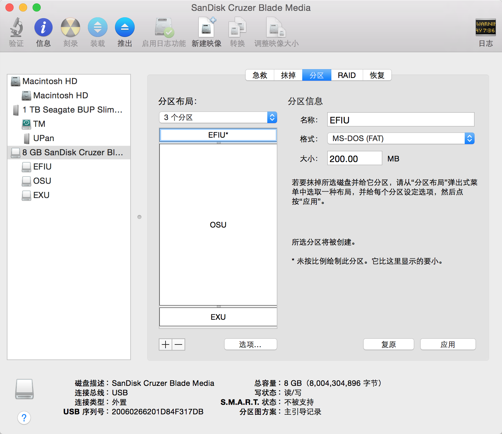

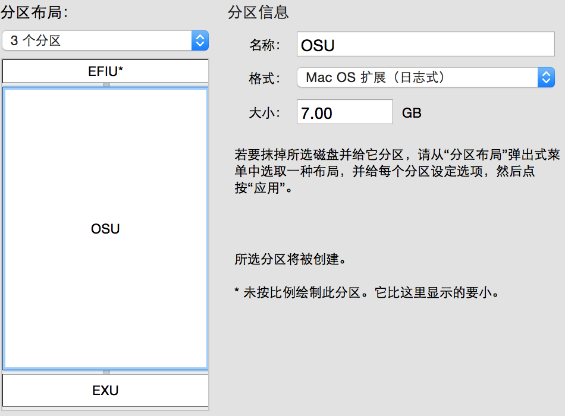  
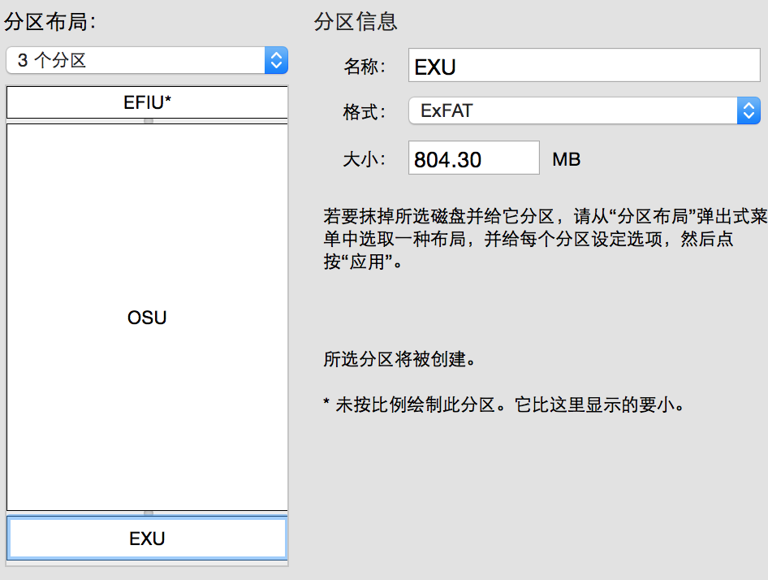  
  
#####0.2 写入10.10.app  

    sudo 10.10.app/Contents/Resources/createinstallmedia --volume U盘位置 --applicationpath 10.10.app --no interaction  

例如：  

    sudo /Volumes/UPan/OS/Install\ OS\ X\ Yosemite.app/Contents/Resources/createinstallmedia --volume /Volumes/OSU/ --applicationpath /Volumes/UPan/OS/Install\ OS\ X\ Yosemite.app --no interaction  
  
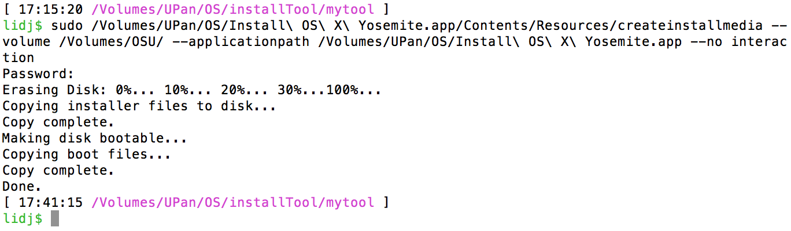  
  
  
#####0.3 clover 安装到U盘(选择U盘,其实是安装到U盘的EFI分区)  
下载 http://sourceforge.net/projects/cloverefiboot/  
0.3.1分一个分区时：  
格式化EFI 为FAT32F分区 ,否则clover configer 看不到  

    $ diskutil list  
    $ sudo newfs_msdos -v EFI -F 32 /dev/rdisk3s1  

三个分区时,直接安装选择200M的FAT分区。  
0.3.2安装为EFI模式  
  
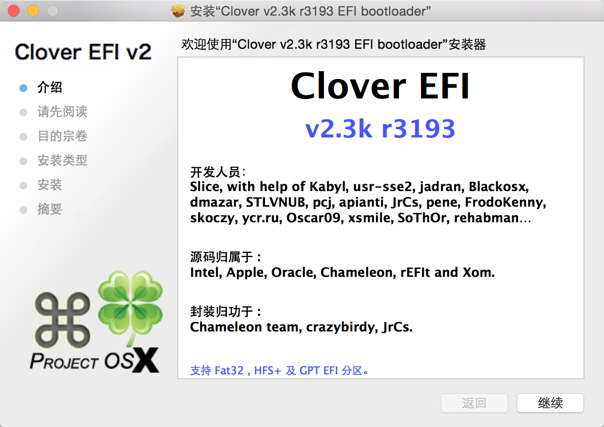  
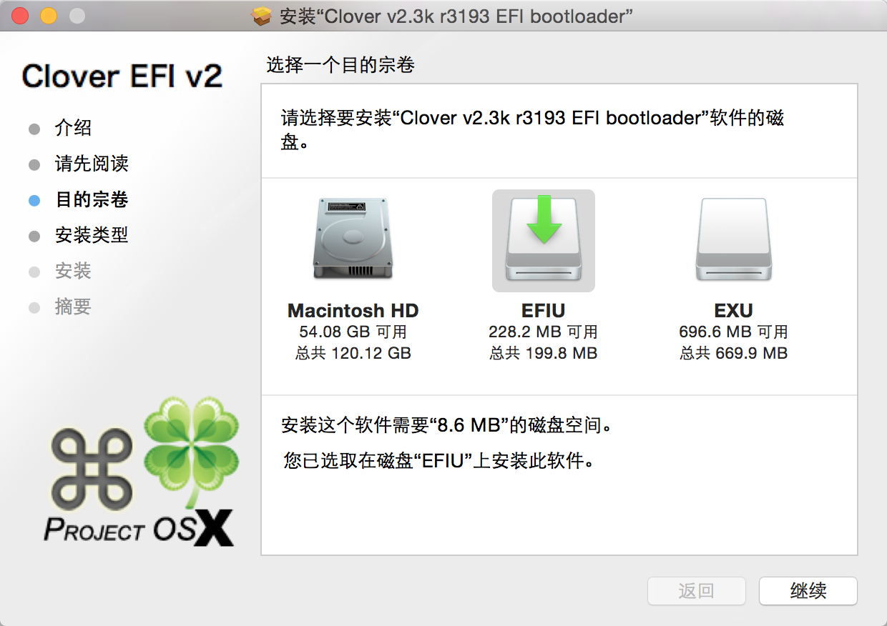  
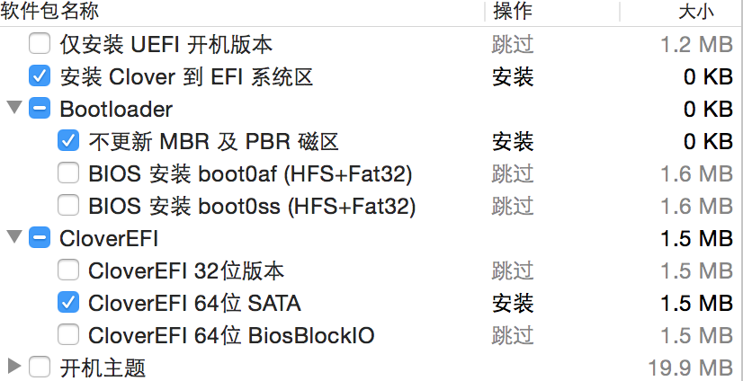  
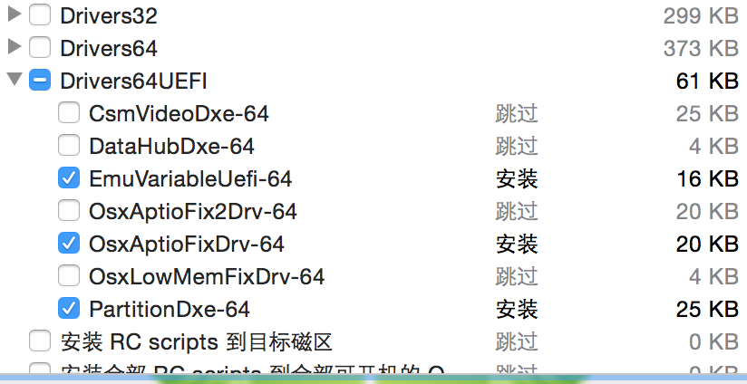  
  
  
0.3.3 clover 配置  
  
首先默认选项全部清空,尤其是injectATI INTEL NV,然后 drivers64UEFI/中加入HFSPlus.efi ,删除VBoxHfs-64.efi.//否则五国：AppleACPIPlatform + IOPCIFamily 错误。  
  
加入FakeSMC.kext  
  
除了,   
Boot:  kext-dev-mode=1   
System Parameters:Inject Kexts=yes //否则kexts/10.10/下的驱动不加载,包括FakeSMC.kext..  
Devices:USB Inject=yes FixOwnership=yes //否则五国 waitting on <dict ID="0">....  
  
参见http://www.tonymacx86.com/yosemite-desktop-guides/144426-how-install-os-x-yosemite-using-clover.html  
  
####1. 安装系统  
转化硬盘从MBR到GPT(新买的INTEL SSD 没有转化,但成功了,可能默认为GPT).  
  
#####1.1 安装时BIOS设置  
硬盘AHCI模式,不需要关闭USB3.0  
EFI+GPT  
  
#####1.2 排除五国  
没有五国  
#####1.3 安装系统  
选择语言->磁盘工具->安装到SSD。。。大概十几分钟  
重启一次,U盘启动,选择"Install ..."继续,十分钟左右  
重启,选择 SSD硬盘 进入系统配置  
  
  
#####1.4 安装clover到硬盘EFI分区,设置启动为EFI+GPT  
转化EFI分区为FAT32格式,以便以后安装MAC+WINDOWS双系统,  

    $ diskutil list  
    $ sudo newfs_msdos -v EFI -F 32 /dev/rdisk0s1  

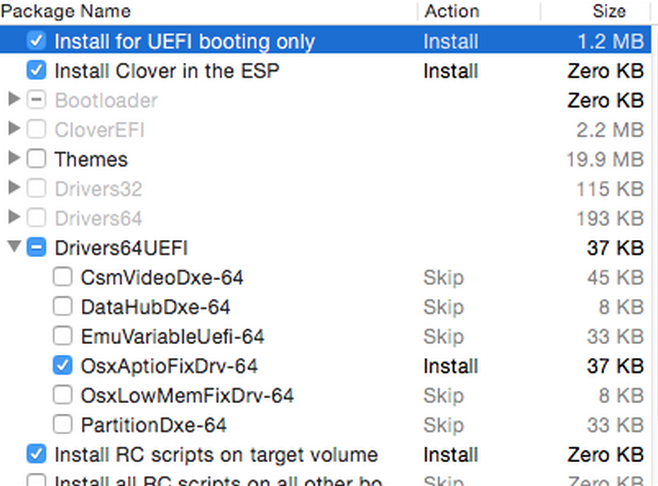  
  
Boot: -v kext-dev-mode=1   
Devices:USB Inject=yes FixOwnership=yes(?)  
拷入FakeSMC.kext   
  
####2 安装驱动  
#####2.1 显卡  
Graphics:Inject Intel=yes,ig-platform-id=0x0d220003//(驱动HD4600)  
Ingect EDID =yes,Custom EDID=....//(识别显示器)  
2.1.1 怎么得到EDID？  
我是链接到白苹果上,用SwitchResX得到的  
#####2.2 声卡  
安装VoodooHDA.pmg ,开机有电流音,修改kext里info.list中的iGain=0,iMix=90  
#####2.3 网卡  
RealtekRTL8111.kext到kexts/10.10  
#####2.4 加载驱动,需要clover设置  
System Parameters:Inject Kexts=yes ,No Caches=yes  
  
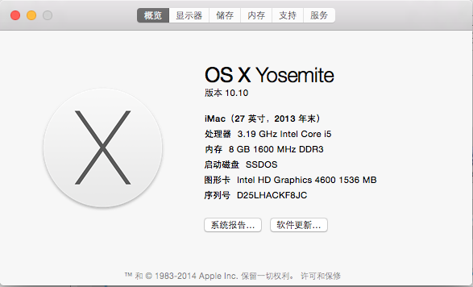  
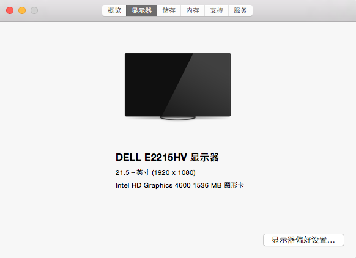  
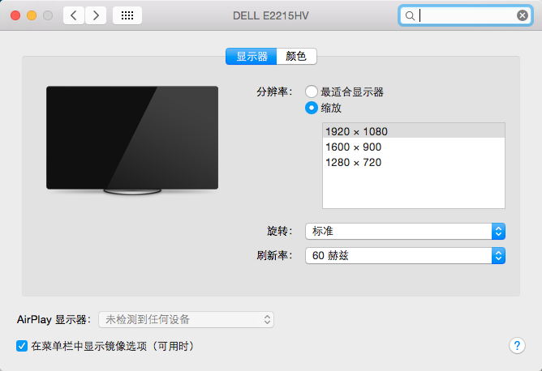  
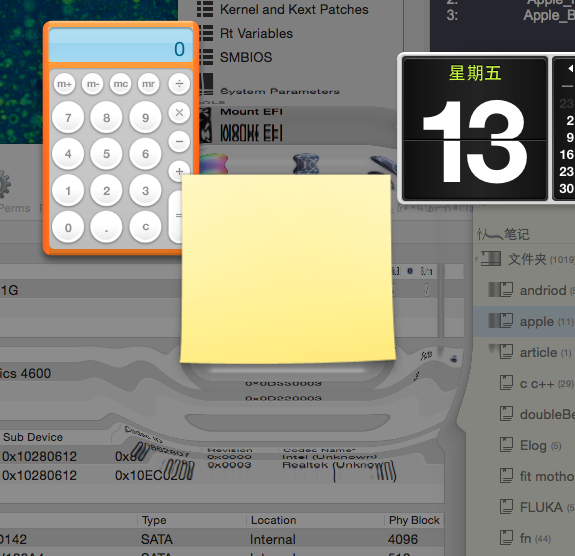  
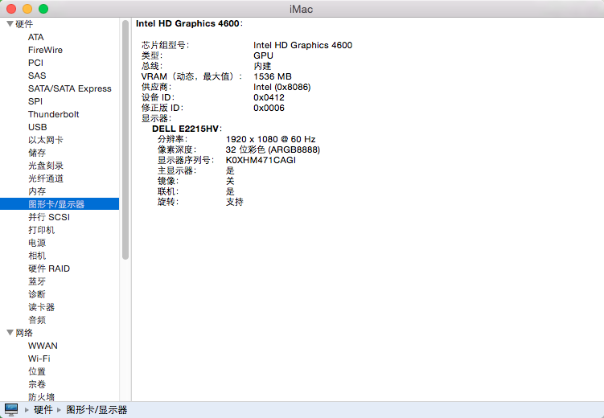  
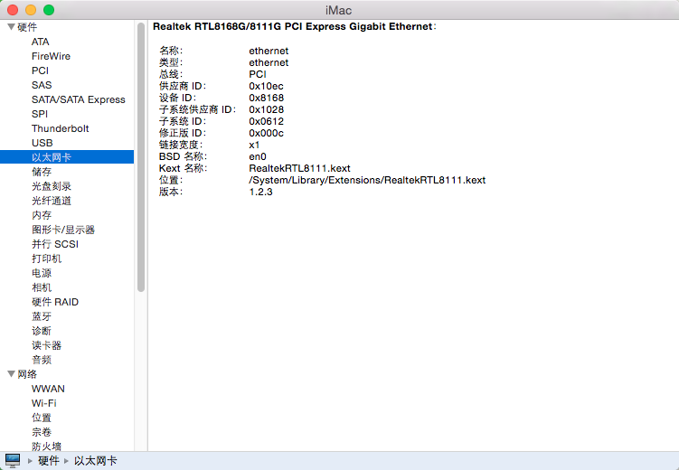  
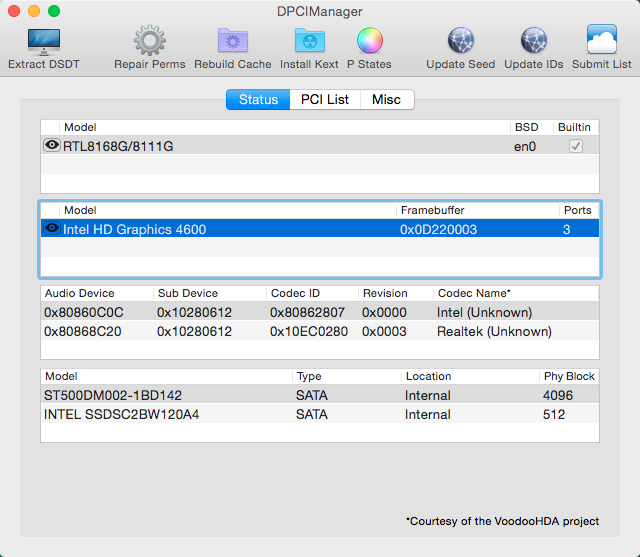  
  
####3 其他  
#####3.1 降频？  
不需要,自动调频  
  
####4  移动多媒体类的文件夹到第二个硬盘  

    lidj$ sudo mv Movies/ /Volumes/SecMedia/  
    lidj$ ln -s /Volumes/SecMedia/Movies/ Movies  

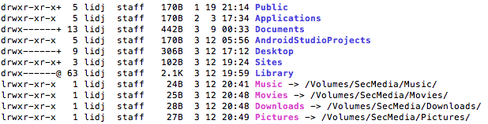  

