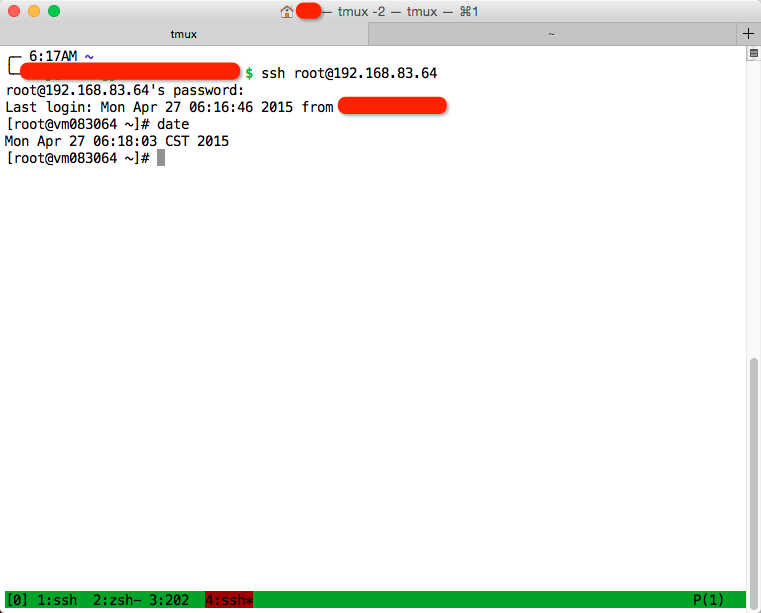

#缘由#

所里网络有流量限制,一个月3G,但所里的服务器可无限流量访问外网,同时个人的电脑访问所服务器属于内网流量,不包含在3G/month内,故可以通过服务器做代理链接外网,普通用户在服务器上只有SSH账户,可以用SSH 隧道(SSH -D 5555 xxx@xxxx)做SOCKS代理,配合proxifier或ProxyCap可配置成全局代理,虽然SOCKS5支持UDP,但SSH不支持UDP,所以这种代理只可以转发TCP数据包,对于浏览网页足以,但大部分游戏和QQ都使用UDP协议,对于偶尔玩局DOTA2的我来说还是不完美.

最近所里计算中心推出云虚拟机服务(VPS),有Scientific Linux 7(和RedHat/CentOS同一体系) 和win7镜像可选择,拥有ROOT权限和外网IP,这样就可以在VPS上安装VPN代理,让内网机器链接VPN服务器上外网,这时这个VPN服务器起到了网关路由器作用.路由器岂是相当就能当？这就是VPN的伟大之处,虚拟局域网的作用.

#安装#

详情参见[Centos7(Linux)版OpenVPN安装 配置教程](http://blog.csdn.net/mimi00x/article/details/40383285)，以下仅为备忘步骤.

> "# "为服务器端root权限命令行

> "$ "为客户端普通权限命令行

> "//"为注释

##1.安装OpenVPN##

    //安装gcc openssl lzo pam 
    # yum install -y gcc openssl-devel lzo-devel pam-devel
    
    //[下载openvpn-2.3.4](http://www.softown.cn/soft/openvpn/linux),解压
    # tar zxf openvpn-2.3.4.tar.gz
    
    //编译安装,默认到源代码所在目录,这里在~/下
    # cd ~/openvpn-2.3.4
    # ./configure;make;make install
    
##2.生成证书##

    //[下载easy-rsa](http://pan.baidu.com/s/1o66Yaz4),解压,把其中的 easy-rsa 复制到上面的OpenVPN-2.3.4/下
    # unzip easy-rsa-release-2.x.zip

    //进入 ~/openvpn-2.3.4/easy-rsa/2.0 
    # cp -r easy-rsa-release-2.x/easy-rsa  ~/openvpn-2.3.4/
    # cd ~/openvpn-2.3.4/easy-rsa/2.0 

    //生成CA证书
    //初始化命令,用于设置后续命令所需的相关变量信息,可编辑vars里的信息:
    //KEY_COUNTRY:所在国家
    //KEY_PROVINCE:所在省
    //KEY_CITY:所在城市
    //KEY_ORG:所在组织
    //KEY_EMAIL:邮箱地址
    //KEY_OU:机构单位或部门名称
    # vi vars
    # ./vars 
    //清除之前创建的所有证书和密钥 
    # ./clean-all 
    //生成CA证书和密钥,如果不输入 直接回车,则表示该字段使用"[]"中的默认值(也就是前面vars文件中设置的参数值)；如果输入".",则表示该字段留空.在这里需要注意Common Name字段,这相当于证书的"用户名",请确保每个证书的Common Name字段是唯一的 
    # ./build-ca

    //生成服务器端证书
    # ./build-key-server server

    //生成客户端证书,其中clientName为自定义的客户端名称(例如:client1 client2 jim tom).如果需要为多个客户端生成证书,只需要分别执行多次即可.
    # ./build-key clientName

    //生成迪菲·赫尔曼交换密钥,(无需额外输入,耐心等待生成完毕即可).迪菲·赫尔曼交换密钥是一种安全协议,用以对数据进行加密
    # ./build-dh

    ##服务器端需要用到的文件有:##
    ca.crt
    ca.key
    dh2048.pem (如果最初的变量KEY_SIZE设为1024,这里就是dh1024.pem)
    server.crt
    server.key
    ##客户端client1需要用到的文件有:##
    ca.crt
    client1.crt
    client1.key (名称client1根据个人设置可能有所不同)

##3.修改配置文件.conf,后缀名修改为.ovpn则为windws版配置文件##

    //为服务器和每个客户端的config目录分别编写一个配置文件,服务器端的配置文件为server.conf,客户端的配置文件为client.conf.OpenVPN已经在sample/sample-config-files子目录中为我们提供了相关的示例文件server.conf和client.conf
    # vi ~/openvpn-2.3.4/sample/sample-config-files/server.conf

    //修改下面选项
    port 51194            //指定监听的本机端口号,默认为1194,修改掉以防该端口被封掉
    dh dh2048.pem         //指定迪菲赫尔曼参数的文件路径,默认为dh1024.pem
    server 10.88.0.0 255.255.255.0   //指定虚拟局域网占用的IP地址段和子网掩码,此处配置的服务器自身占用10.88.0.1.
    proto tcp //指定采用的传输协议,可以选择tcp或udp ,默认为UDP,会造成游戏数据丢包,修改为TCP,把UDP数据包放到TCP包里传输,保证高的正确接收
    push "redirect-gateway def1 bypass-dhcp" //设置服务器为代理路由器,否则客户端流量不走服务器,这点至关重要！！！
    push "dhcp-option DNS 202.38.128.58"//设置客户端DNS,否则的话客户端Ping不通域名
    push "dhcp-option DNS 202.38.128.10"

    //客户端配置文件client.conf
    # vi ~/openvpn-2.3.4/sample/sample-config-files/client.conf
    //修改下面选项
    proto tcp            //必须与服务器端的保持一致
    remote sip 1194      //指定连接的远程服务器的实际IP地址和端口号
    cert client1.crt     //指定当前客户端的证书文件路径,修改为上面生成的客户端crt名字
    key client1.key      //指定当前客户端的私钥文件路径 ,修改为上面生成的客户端key名字

##4.复制证书秘钥到config##

    //OpenVPN虽然可以分为客户端和服务器,不过它们的安装程序是完全一样的,只是通过不同的证书和配置文件来进行区分.在这里,我们先在OpenVPN主目录下创建一个config目录,并将其所需的证书,密钥文件,配置文件拷贝到该目录中.
    # mkdir ~/openvpn-2.3.4/config
    //复制证书和密钥文件到config目录 
    //服务器端
    # cd ~/openvpn-2.3.4/easy-rsa/2.0 
    # cp ca.crt ca.key server.crt server.key dh2048.pem ~/openvpn-2.3.4/config
    # cp ~/openvpn-2.3.4/sample/sample-config-files/server.conf ~/openvpn-2.3.4/config
    //客户端
    # cd ~/openvpn-2.3.4/easy-rsa/2.0 
    # cp ca.crt client1.crt client1.key ~/openvpn-2.3.4/config 
    # cp ~/openvpn-2.3.4/sample/sample-config-files/client.conf ~/openvpn-2.3.4/config

##5.启动OpenVPN##

    //在Linux中,我们可以直接执行以下命令来启动OpenVPN,如果你是服务器端,就指定server.conf文件的路径,如果你是客户端就指定client.conf文件的路径.由于我们在配置文件中设置的文件路径都是相对config目录的路径,因此我们也只能在config目录下才能正常启动OpenVPN.如果你想在任何地方都能使用上述命令启动OpenVPN,建议你将配置文件与文件路径相关的部分全部改为绝对路径.
    # nohup openvpn 配置文件路径 //nohup保证断开ssh后仍旧能保持进程的运行

##6.配置防火墙iptables NAT,配置路由器数据转发功能##

    //1.CentOS7防火墙默认为firewalld(默认不开启),这里安装iptables防火墙
    # yum install iptables.services
    //查看是否安装上,下面为正常,若显示Loaded: not-found (Reason: No such file or directory),重启VPS即可.
    # system status iptables
    iptables.service - IPv4 firewall with iptables
    Loaded: loaded (/usr/lib/systemd/system/iptables.service; disabled)
    Active: inactive (dead)
    //启动iptables
    # systemctl start iptables

    //2.开启网关服务器的路由转发
    # vi /etc/sysctl.conf
    net.ipv4.ip_forward = 1
    //重启内核,使之生效
    # sysctl -p

    //3.设置转发
    # iptables -F
    # iptables -t nat -A POSTROUTING -s 192.168.2.0/24   -j SNAT --to-source 192.168.2.119
    # service iptables save
    # systemctl restart iptables

##7.安装客户端##

前提是得到客户端的ca.crt client1.crt client1.key client.conf

###MAC OS X###

1.[下载Tunnelblick](http://www.macupdate.com/app/mac/16969/tunnelblick)

2.安装Tunnelblick,到"磁盘工具"里"修复磁盘权限",因为这个软件添加了驱动.kert,否则链接不上

3.双击 client.conf,就可以自动导入配置

###Linux###

跟服务器端一样的源代码,编译安装,不过不用生成证书,不用配置防火墙,步骤为

0.[下载openvpn-3.2.4.tar.gz](http://www.softown.cn/soft/openvpn/linux)

1 编译安装

4 复制文件到config

5 运行:openvpn client.conf & //&转后台运行. 

###windows###

1.[下载OpenVPN](http://openvpn.ustc.edu.cn/)

2.安装时 系统=win7,可正常安装,win8安装TAP驱动出现错误,自行搜索.

3.把文件复制到C:\program files\openvpn\config,也可能是C:\Program Files (x86)\OpenVPN\config

4.管理员权限启动openvpn-gui.exe

#效果#

流量全走VPN,计流量系统中查询不到.tcpdump参看客户端数据包详情,除了客户端IP(clip)和服务器端IP(sip)之间的数据包,其他仅为非常少的IPv6广播包

    $ sudo tcpdump host clip and ! sip
    05:21:28.086197 ARP, Request who-has 10.10.0.1 tell 10.10.5.251, length 28 
    05:21:28.092687 ARP, Reply 10.10.0.1 is-at 00:1b:21:b2:66:c9 (oui DCBX), length 28

链接稳定

  

意外效果:

ipv6网站可正常访问,无做其他设置.

-------------------
#其他参考资料#

2. [使用Proxifier 把ssh shadowsocks代理转为全局代理](http://boafanx.tabboa.com/77.boafanx)
1. tcpdump:截获网络数据包 [Linux tcpdump命令详解](http://www.cnblogs.com/ggjucheng/archive/2012/01/14/2322659.html)
4. nc;端口数据监控 [linux下nc的使用](http://qing.blog.sina.com.cn/1285469314/4c9eb48233004b2l.html)
8. nmap:扫描端口 [NMAP 基础教程](http://drops.wooyun.org/tips/2002)
9. traceroute:跟踪路由 [linux之traceroute用法详解](http://yp.oss.org.cn/software/show_resource.php?resource_id=1057)
3. iptables:CentOS防火墙 [Iptables工具的使用](http://www.cnblogs.com/linuxer/archive/2012/04/10/2870538.html)
5. [iptables实现路由转发的例子](http://www.jbxue.com/LINUXjishu/3269.html)
6. PF:MAC OS X 防火墙 [PF APPLE官方资料](https://developer.apple.com/library/mac/documentation/Darwin/Reference/ManPages/man5/pf.conf.5.html)
7. [PF: Getting Started](http://www.openbsd.org/faq/pf/config.html)

-------------------
##怎么申请所里虚拟主机(VPS)##

1. 用邮箱账户和密码[登陆](https://login.ihep.ac.cn/login)

2. click it 

  

3. 姓名全拼+邮箱密码登入

4. 按下面顺序操作

  

配置 as your like,

  

得到

  

5. ssh登陆VPS,密码默认为 `vm;654321`

    # ssh root@192.168.83.64

6. Do something you like.

  

-------------------

##我为什么选择OpenVPN##

一开始奔着简单去,安装了PPTP,安装方法参见[CentOS 6.3配置PPTP VPN的方法](http://www.heminjie.com/system/linux/307.html),不同体系的系统在"配置iptables转发"会不一样,cenos redhat sl体系如文中所述.

下文中 sip为服务器端IP,clip为客户端IP.

无奈链接不上,用nmap扫描端口,端口正常

    # nmap sip

    Starting Nmap 6.40 ( http://nmap.org ) at 2015-04-24 01:01 CST
    Nmap scan report for sip
    Host is up (0.0000070s latency).
    Not shown: 997 closed ports
    PORT     STATE SERVICE
    22/tcp   open  ssh
    111/tcp  open  rpcbind
    1723/tcp open  pptp

用tcpdump分别在客户端和服务器端截取数据包

    //客户端
    $ sudo tcpdump host clip and sip

    //tcp 三次握手建立链接
    23:19:14.735117 IP 10.10.5.251.60129  > sip.1723: Flags [S], seq 3346976484, win 65535, options [mss 1460,nop,wscale 5,nop,nop,TS val 1172463360 ecr 0,sackOK,eol], length 0
    23:19:14.742169 IP sip.1723 > 10.10.5.251.60129: Flags [S.], seq 3764887308, ack 3346976485, win 14480, options [mss 1460,sackOK,TS val 91220646 ecr 1172463360,nop,wscale 7], length 0
    23:19:14.742219 IP 10.10.5.251.60129  > sip.1723: Flags [.], ack 1, win 4117, options [nop,nop,TS val 1172463367 ecr 91220646], length 0
    
    //通过1723端口tcp数据包交换控制信息,建立GRE传送通道
    23:19:14.742251 IP 10.10.5.251.60129  > sip.1723: Flags [P.], seq 1:157, ack 1, win 4117, options [nop,nop,TS val 1172463367 ecr 91220646], length 156: pptp CTRL_MSGTYPE=SCCRQ PROTO_VER(1.0) FRAME_CAP(A) BEARER_CAP(A) MAX_CHAN(0) FIRM_REV(0) HOSTNAME() VENDOR()
    23:19:14.745603 IP sip.1723 > 10.10.5.251.60129: Flags [.], ack 157, win 122, options [nop,nop,TS val 91220653 ecr 1172463367], length 0
    23:19:14.762489 IP sip.1723 > 10.10.5.251.60129: Flags [P.], seq 1:157, ack 157, win 122, options [nop,nop,TS val 91220669 ecr 1172463367], length 156: pptp CTRL_MSGTYPE=SCCRP PROTO_VER(1.0) RESULT_CODE(1) ERR_CODE(0) FRAME_CAP() BEARER_CAP() MAX_CHAN(1) FIRM_REV(1) HOSTNAME(local) VENDOR(linux)
    23:19:14.762535 IP 10.10.5.251.60129  > sip.1723: Flags [.], ack 157, win 4112, options [nop,nop,TS val 1172463386 ecr 91220669], length 0
    23:19:14.762595 IP 10.10.5.251.60129  > sip.1723: Flags [P.], seq 157:325, ack 157, win 4112, options [nop,nop,TS val 1172463386 ecr 91220669], length 168: pptp CTRL_MSGTYPE=OCRQ CALL_ID(13008) CALL_SER_NUM(0) MIN_BPS(300) MAX_BPS(100000000) BEARER_TYPE(Any) FRAME_TYPE(E) RECV_WIN(64) PROC_DELAY(0) PHONE_NO_LEN(0) PHONE_NO() SUB_ADDR()
    23:19:14.766699 IP sip.1723 > 10.10.5.251.60129: Flags [P.], seq 157:189, ack 325, win 130, options [nop,nop,TS val 91220673 ecr 1172463386], length 32: pptp CTRL_MSGTYPE=OCRP CALL_ID(0) PEER_CALL_ID(13008) RESULT_CODE(1) ERR_CODE(0) CAUSE_CODE(0) CONN_SPEED(100000000) RECV_WIN(64) PROC_DELAY(0) PHY_CHAN_ID(0)
    23:19:14.766726 IP 10.10.5.251.60129  > sip.1723: Flags [.], ack 189, win 4111, options [nop,nop,TS val 1172463389 ecr 91220673], length 0
    23:19:14.766755 IP 10.10.5.251.60129  > sip.1723: Flags [P.], seq 325:349, ack 189, win 4111, options [nop,nop,TS val 1172463389 ecr 91220673], length 24: pptp CTRL_MSGTYPE=SLI PEER_CALL_ID(0) SEND_ACCM(0xffffffff) RECV_ACCM(0xffffffff)

    //通过GRE 47号协议传输数据,不是47号端口.
    23:19:14.784632 IP 10.10.5.251        > sip: GREv1, call 0, seq 1, ack 0, length 40: LCP, Conf-Request (0x01), id 1, length 22
    23:19:14.811724 IP sip.1723 > 10.10.5.251.60129: Flags [.], ack 349, win 130, options [nop,nop,TS val 91220716 ecr 1172463389], length 0
    23:19:17.878070 IP 10.10.5.251        > sip: GREv1, call 0, seq 2, ack 0, length 40: LCP, Conf-Request (0x01), id 1, length 22
    23:19:20.974037 IP 10.10.5.251        > sip: GREv1, call 0, seq 3, ack 0, length 40: LCP, Conf-Request (0x01), id 1, length 22
    23:19:24.073192 IP 10.10.5.251        > sip: GREv1, call 0, seq 4, ack 0, length 40: LCP, Conf-Request (0x01), id 1, length 22
    23:19:27.166156 IP 10.10.5.251        > sip: GREv1, call 0, seq 5, ack 0, length 40: LCP, Conf-Request (0x01), id 1, length 22
    23:19:30.266323 IP 10.10.5.251        > sip: GREv1, call 0, seq 6, ack 0, length 40: LCP, Conf-Request (0x01), id 1, length 22
    23:19:33.366152 IP 10.10.5.251        > sip: GREv1, call 0, seq 7, ack 0, length 40: LCP, Conf-Request (0x01), id 1, length 22
    23:19:34.833645 IP 10.10.5.251.60129  > sip.1723: Flags [.], ack 189, win 4111, length 0
    23:19:34.837934 IP sip.1723 > 10.10.5.251.60129: Flags [.], ack 349, win 130, options [nop,nop,TS val 91240745 ecr 1172463389], length 0
    23:19:36.466142 IP 10.10.5.251        > sip: GREv1, call 0, seq 8, ack 0, length 40: LCP, Conf-Request (0x01), id 1, length 22
    23:19:39.566115 IP 10.10.5.251        > sip: GREv1, call 0, seq 9, ack 0, length 40: LCP, Conf-Request (0x01), id 1, length 22
    23:19:42.666162 IP 10.10.5.251        > sip: GREv1, call 0, seq 10, ack 0, length 40: LCP, Conf-Request (0x01), id 1, length 22
   
    //tcp 4次握手关闭链接 
    23:19:45.020055 IP sip.1723 > 10.10.5.251.60129: Flags [F.], seq 189, ack 349, win 130, options [nop,nop,TS val 91250812 ecr 1172463389], length 0
    23:19:45.020094 IP 10.10.5.251.60129  > sip.1723: Flags [.], ack 190, win 4111, options [nop,nop,TS val 1172493608 ecr 91250812], length 0
    23:19:45.021416 IP 10.10.5.251.60129  > sip.1723: Flags [F.], seq 349, ack 190, win 4111, options [nop,nop,TS val 1172493609 ecr 91250812], length 0
    23:19:45.023934 IP sip.1723 > 10.10.5.251.60129: Flags [.], ack 350, win 130, options [nop,nop,TS val 91250930 ecr 1172493609], length 0
    
    //服务器端
    # tcpdump host clip and sip
    //tcp 三次握手建立链接
    ...
    //通过1723端口tcp数据包交换控制信息,建立GRE传送通道
    ...
    //通过GRE 47号协议传输数据,不是47号端口.
    00:36:27.519495 IP sip > 10.10.5.251: GREv1, call 13179, seq 0, length 41: LCP, Conf-Request (0x01), id 1, length 27
    00:36:27.556607 IP sip.pptp > 10.10.5.251.62482: Flags [.], ack 349, win 130, options [nop,nop,TS val 95853443 ecr 1177082162], length 0
    00:36:30.518295 IP sip > 10.10.5.251: GREv1, call 13179, seq 1, length 41: LCP, Conf-Request (0x01), id 1, length 27
    00:36:33.521385 IP sip > 10.10.5.251: GREv1, call 13179, seq 2, length 41: LCP, Conf-Request (0x01), id 1, length 27
    00:36:36.524472 IP sip > 10.10.5.251: GREv1, call 13179, seq 3, length 41: LCP, Conf-Request (0x01), id 1, length 27
    00:36:39.527595 IP sip > 10.10.5.251: GREv1, call 13179, seq 4, length 41: LCP, Conf-Request (0x01), id 1, length 27
    00:36:42.530681 IP sip > 10.10.5.251: GREv1, call 13179, seq 5, length 41: LCP, Conf-Request (0x01), id 1, length 27
    00:36:45.533800 IP sip > 10.10.5.251: GREv1, call 13179, seq 6, length 41: LCP, Conf-Request (0x01), id 1, length 27
    00:36:47.599935 IP 10.10.5.251.62482 > sip.pptp: Flags [.], ack 189, win 4111, length 0
    00:36:47.599999 IP sip.pptp > 10.10.5.251.62482: Flags [.], ack 349, win 130, options [nop,nop,TS val 95873486 ecr 1177082162], length 0
    00:36:48.536954 IP sip > 10.10.5.251: GREv1, call 13179, seq 7, length 41: LCP, Conf-Request (0x01), id 1, length 27
    00:36:51.540067 IP sip > 10.10.5.251: GREv1, call 13179, seq 8, length 41: LCP, Conf-Request (0x01), id 1, length 27
    00:36:54.543181 IP sip > 10.10.5.251: GREv1, call 13179, seq 9, length 41: LCP, Conf-Request (0x01), id 1, length 27
    
    //tcp 4次握手关闭链接 
    ...

TCP GRE 协议部分参见[TCP协议中的三次握手和四次挥手(图解)](http://blog.csdn.net/whuslei/article/details/6667471) [PPTP - GRE](http://blog.csdn.net/msptop/article/details/2451138) [PPTP/L2TP协议讲述以及应用部署](http://blog.163.com/hlz_2599/blog/static/142378474201341511122929/),对比服务器和客户端没有接收到对方的GRE数据包,此时两者都已关闭了防火墙,故可推断在两者之间的某个路由上有防火墙过滤了GRE协议,或它老旧不支持.这样一来PPTP和L2TP都不可采取.

不得不采用OpenVPN.

##VPN种类##

PPTP L2TP OpenVPN 三种的区别参见:[VPN协议PPTP L2TP OpenVPN](http://www.cnblogs.com/adforce/p/3511692.html)

摘录如下,以备原文不在:

> ###一 PPTP L2TP OpenVPN三种隧道协议的概念###
> 
> ####1 PPTP(Point to Point Tunneling Protocol,点对点隧道协议)默认端口号:1723####
> 
> PPTP,即PPTF协议.该协议是在PPP协议的基础上开发的一种新的增强型安全协议,支持多协议虚拟专用网(VPN),可以通过密码身份验证协议(PAP) 可扩展身份验证协议(EAP)等方法增强安全性.可以使远程用户通过拨入ISP 通过直接连接Internet或其他网络安全地访问企业网.
> 
> 点对点隧道协议(PPTP)是一种支持多协议虚拟专用网络的网络技术,它工作在第二层.通过该协议,远程用户能够通过 Microsoft Windows NT工作站 Windows xp  Windows 2000 和windows2003 windows7操作系统以及其它装有点对点协议的系统安全访问公司网络,并能拨号连入本地ISP,通过Internet 安全链接到公司网络.
> 
> PPTP协议是点对点隧道协议,其将控制包与数据包分开,控制包采用TCP控制.PPTP使用TCP协议,适合在没有防火墙限制的网络中使用.
> 
> [百度百科](http://baike.baidu.com/link?url=hHnpi2pyUWox7o6tbuGhyEi-jUPBmtpxlWRvVvE_LZfTAFmQOY2KPXqUzfAPHcql)
> 
> ####2 L2TP(Layer 2 Tunneling Protocol,第二层隧道协议)####
> 
> L2TP是一种工业标准的Internet隧道协议,功能大致和PPTP协议类似,比如同样可以对网络数据流进行加密.不过也有不同之处,比如PPTP要求网络为IP网络,L2TP要求面向数据包的点对点连接；PPTP使用单一隧道,L2TP使用多隧道；L2TP提供包头压缩 隧道验证,而PPTP不支持.
> 
> L2TP是一个数据链路层协议,基于UDP.其报文分为数据消息和控制消息两类.数据消息用投递 PPP 帧,该帧作为L2TP报文的数据区.L2TP不保证数据消息的可靠投递,若数据报文丢失,不予重传,不支持对数据消息的流量控制和拥塞控制.控制消息用以建立 维护和终止控制连接及会话,L2TP确保其可靠投递,并支持对控制消息的流量控制和拥塞控制.
> 
> L2TP是国际标准隧道协议,它结合了PPTP协议以及第二层转发L2F协议的优点,能以隧道方式使PPP包通过各种网络协议,包括ATM SONET和帧中继.但是L2TP没有任何加密措施,更多是和IPSec协议结合使用,提供隧道验证.
> 
> L2TP使用UDP协议,一般可以穿透防火墙,适合在有防火墙限制 局域网用户,如公司 网吧 学校等场合使用.
> 
> PPTP和L2TP二个连接类型在性能上差别不大,如果使用PPTP不正常,那就更换为L2TP.
> 
> [百度百科](http://baike.baidu.com/link?url=t6G3hu_r6-pfi-GN8cCXg5Vx3F_Rk4fEdvXS80l2zstTub7gXMNQzOIPTKfjd_FU)
> 
> ####3 OpenVPN####
> 
> OpenVpn的技术核心是虚拟网卡,其次是SSL协议实现.
> 
> 虚拟网卡是使用网络底层编程技术实现的一个驱动软件,安装后在主机上多出现一个网卡,可以像其它网卡一样进行配置.服务程序可以在应用层打开虚拟网卡,如果应用软件(如IE)向虚拟网卡发送数据,则服务程序可以读取到该数据,如果服务程序写合适的数据到虚拟网卡,应用软件也可以接收得到.虚拟网卡在很多的操作系统下都有相应的实现,这也是OpenVpn能够跨平台一个很重要的理由.
> 
> OpenVPN使用OpenSSL库加密数据与控制信息:它使用了OpenSSL的加密以及验证功能,意味着,它能够使用任何OpenSSL支持的算法.它提供了可选的数据包HMAC功能以提高连接的安全性.此外,OpenSSL的硬件加速也能提高它的性能.
> 
> OpenVPN所有的通信都基于一个单一的IP端口,默认且推荐使用UDP协议通讯,同时TCP也被支持.
> 
> 在选择协议时候,需要注意2个加密隧道之间的网络状况,如有高延迟或者丢包较多的情况下,请选择TCP协议作为底层协议,UDP协议由于存在无连接和重传机制,导致要隧道上层的协议进行重传,效率非常低下.
> 
> OpenVPN是一个基于SSL加密的纯应用层VPN协议,是SSL VPN的一种,支持UDP与TCP两种方式(说明:UDP和TCP是2种通讯协议,这里通常UDP的效率会比较高,速度也相对较快.所以尽量使用UDP连接方式,实在UDP没法使用的时候,再使用TCP连接方式).
> 
> 由于其运行在纯应用层,避免了PPTP和L2TP在某些NAT设备后面不被支持的情况,并且可以绕过一些网络的封锁(通俗点讲,基本上能上网的地方就能用OpenVPN).
> 
> OpenVPN客户端软件可以很方便地配合路由表,实现不同线路(如国内和国外)的路由选择,实现一部分IP走VPN,另一部分IP走原网络.
> 
> [百度百科](http://baike.baidu.com/link?url=00I2C_Gm7Xvcma3QJYHCrJJ0-xcdcNbcSAMNyuxozggQ0LVxeOkZklkiMqbL_j37D0ucvHfsWmlaZbQUlhxO3q)
> 
>  
> 
> ###二 PPTP L2TP OpenVPN三种隧道协议的优缺点对比###
> 
> 易用性:    PPTP > L2TP > OpenVPN

> 速度:      PPTP > OpenVPN UDP > L2TP > OpenVPN TCP

> 安全性:    OpenVPN > L2TP > PPTP

> 稳定性:    OpenVPN > L2TP > PPTP

> 网络适用性:OpenVPN > PPTP > L2TP
> 
>  
> 
> ###三 VPN协议的选择###
> 
> 电脑上优先使用PPTP,无法使用可以尝试L2TP,对安全性要求高的优先使用OpenVPN.手持设备推荐使用L2TP.
> 
> PPTP:      最常用,设置最简单,大多数设备都支持；

> L2TP:      支持PPTP的设备基本都支持此种方式,设置略复杂,需要选择L2TP/IPSec PSK方式,且设置预共享密钥PSK；

> OpenVPN:最稳定,适用于各种网络环境,但需要安装第三方软件和配置文件,较复杂.

